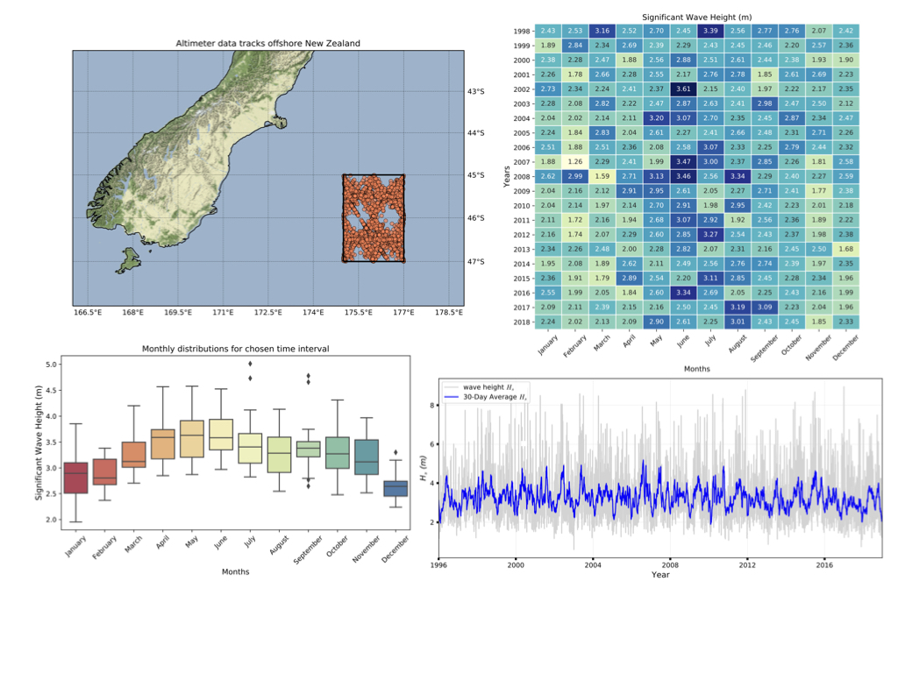

.. RADWave documentation master file, created by
   sphinx-quickstart on Fri May 10 16:22:41 2019.
   You can adapt this file completely to your liking, but it should at least
   contain the root `toctree` directive.

RADWave - *Wave analysis from Altimer data*
=============================================

.. image:: https://readthedocs.org/projects/radwave/badge/?version=latest
  :target: https://radwave.readthedocs.io/en/latest/?badge=latest
  :alt: Documentation Status

**Satellite radar altimeters** can be used to determine significant wave height and wind speed [Young2011]_. Since the first launch of the **GEOSAT** (GEOdetic SATellite) altimeter in 1985, there has been almost continuous data collection. From these measurements one can calculate wave conditions namely wave height, period and power [Young2018]_. Analysis of this long-term, high resolution spatio-temporal record brings new insights into inter-annual, seasonal and decadal variations of regional wave climates.

**RADWave** is Python package that provides a mechanism to access altimeter datasets through web-enabled data services (THREDDS). The package capabilities are illustrated based on the the Australian Ocean Data Network [`AODN <https://portal.aodn.org.au/>`_] database that spans from 1985-present and that has already been calibrated and validated by [Ribal2019]_. **RADWave** allows to query over a range of spatial and temporal scales altimeter parameters in specific geographical regions and subsequently calculates significant wave heights, periods, group velocities, average wave energy densities and wave energy fluxes.

.. hint::
  **RADWave** can be used to easily calculate past wave conditions and infers long term wave climate variability, providing new insights on wave modal conditions, seasonal changes, long-term trends and associated modulation by climate oscillations.

.. note::
  Designed for researchers and industry partners focusing on offshore wave conditions globally, **RADWave** enhances the ease of access and analysis of altimeter data.

Contents
--------

.. toctree::
   method
   installation
   usage
   social
   RADWave
   :maxdepth: 3

Indices and tables
------------------

* :ref:`genindex`
* :ref:`modindex`
* :ref:`search`

.. [Ribal2019] Ribal, A. & Young, I. R. -
    33 years of globally calibrated wave height and wind speed data based on altimeter observations. **Scientific Data** 6(77), p.100, 2019.

.. [Young2011] Young, I. R., Zieger, S. & Babanin, A. V. -
    Global trends in wind speed and wave height. **Science** 332(6028), p451–455, 2011.

.. [Young2018] Young, I. R. & Donelan, M. -
    On the determination of global ocean wind and wave climate from satellite observations. **Remote Sensing of Environment** 215, 228–241, 2018.
