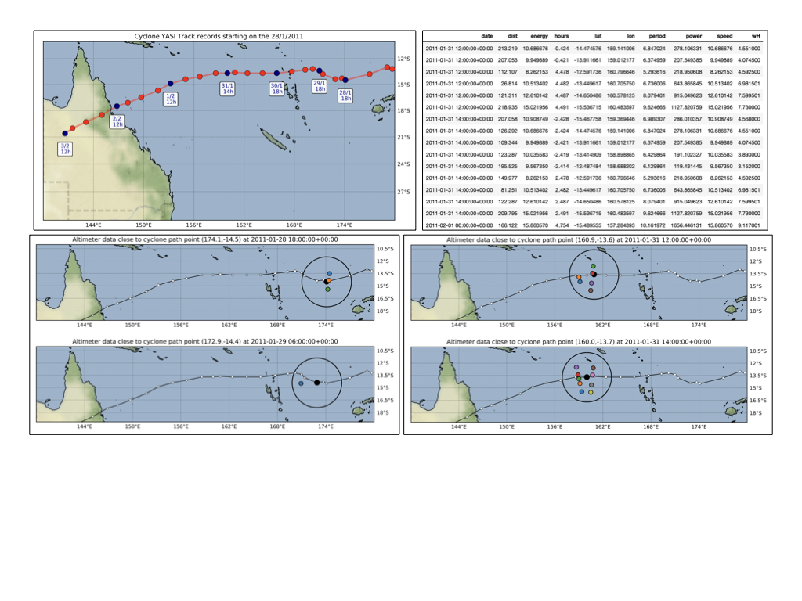
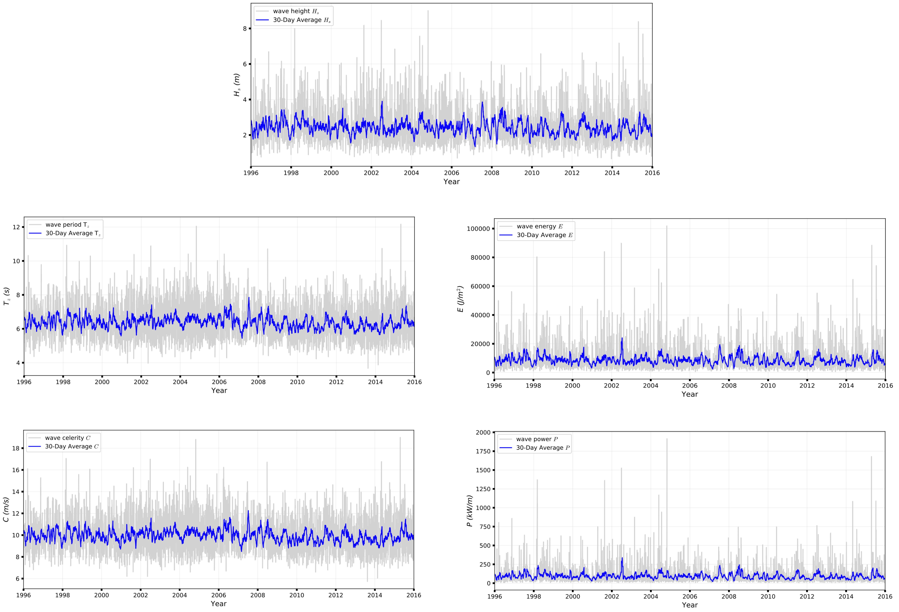

Altimeter data 2 wave climate
================

This page outlines the techniques and methods used to acquire and analyse data from *radar satellite altimeters* and how **RADWave** package uses this dataset to investigate wave parameters, enabling wave climate analysis of varying spatial and temporal resolution.

.. important::
  **RADWave** uses post-processed altimeter dataset to analyse historical wave climate and trends but can also be used to determine cyclone-generated wave conditions.

Satellite Altimeter Data
-------------

Altimeter observations of the ocean surface are been recorded since 1985, with a short break between 1989-1991 due to no operating satellites [Chelton2001]_ (fig. below from `source <http://www.altimetry.info/radar-altimetry-tutorial/how-altimetry-works/>`_). Thirteen altimeters, named **GEOSAT**, **ERS-1**, **TOPEX**, **ERS-2**, **GFO**, **JASON-1**, **ENVISAT**, **JASON-2**, **HAI-YANG-2A**, **SARAL**, **JASON-3** and **SENTINEL-3A**, provides detailed and global coverage.

.. note::
 Satellites were predominantly placed in sun-synchronous, near-polar orbits, covering the same ground track every 3-10 days. Observations are therefore not made every day, however, observation frequency has increased in recent years due to the addition of more altimeters.

.. image:: ../RADWave/Notebooks/images/img3.jpg
  :scale: 8 %
  :alt: Altimeter data
  :align: center

.. attention:
 Twelve of the altimeters operate in the *Ku* frequency band, except for **SARAL**, which uses the *Ka* band.

To increase analysis ability between altimeter missions, [Ribal2019]_ combined and reprocessed data from *Globwave*, *Radar Altimeter Data System* and the *National Satellite Ocean Application Service* to provide a single dataset spanning all thirteen altimeter missions from 1985-2019.

Altimeters measure the ocean surface by emitting a *radar pulse* and determining the shape, power and time delay of the return pulse. The shape is converted into :math:`H_{s}`. The power of the return pulse, also known as the backscatter coefficient, is used to determine *ocean surface properties* including surface roughness. By applying a relationship between uncalibrated wind speed and backscatter coefficient, a **calibrated wind speed** :math:`U_{10}` (10 m above the sea surface and averaged over 10 minutes) can be determined.

.. important::
  Overall, [Ribal2019]_ suggests that preprocessed and calibrated dataset is valid for wind speed below 24 m/s and Hs below 9 m, however, notes that values above this limit are likely still valid.

Wave periods
-----------------------

However, altimeters do not directly measure wave period, an essential component to adequately characterise wave climate.

For waves that have been locally generated by wind, the local wind speed and wave height, both of which are accurately measured by altimeters, can be used to determine :math:`T_{z}` [Quilfen2004]_. More accurate results are achieved when the *wave age* is calculated first, which is the length of time wind has been acting on a wave [Remya2010]_. In **RADWave**, an algorithm derived by [Remya2010]_ is implemented. It estimates :math:`T_{z}` in both wind and swell-generated seas (rmse = 0.76 s).

First, the wave age is calculated through:

.. math::
   \epsilon = 3.25 \frac{H_{s} g}{U_{10}}

where :math:`H_{s}` is the significant wave height, :math:`g` the acceleration by gravity and :math:`U_{10}` the wind speed.

Wave age :math:`\epsilon` is then inputted into a Genetic Algorithm [Remya2010]_ to estimate :math:`T_{z}`:

.. math::
   T_{z} = (((\epsilon - 5.78)/(\epsilon + (U_{10}/H_{s} \times (U_{10}/H_{s}) + H_{s}))))) +(H_{s} + 5.70))

Wave energy, group velocity & power
-----------------------

Mean wave energy density (:math:`E`) (J/m2) is calculated by:

.. math::
   E = \frac{1}{8} \rho g H_{s}^{2}

with :math:`\rho` the density of seawater (set to 1027 kg/m3).

Wave group velocity (:math:`C_{g}`) in deep water conditions is approximated with:

.. math::
   C_{g} = \frac{g T_{z}}{2 \pi}

And wave power $P$ can, therefore, be estimated through:

.. math::
   P = E C_{g}

which is the wave energy flux per metre of wave-crest (W/m). This is then converted into kW/m for ease of analysis.

.. [Chelton2001] Chelton, D.B., Ries, J.C., Haines, B.J., Fu, L.L. & Callahan, P.S. -
    Satellite Altimetry, Satellite altimetry and Earth sciences in L.L. Fu and A. Cazenave Ed., Academic Press, 2001.

.. [Quilfen2004] Quilfen, Y., Chapron, B., Collard, F. & Serre, M. -
    Calibration/validation of an altimeter wave period model and application to Topex/Poseidon and Jason-1 altimeters, **Marine Geodesy**, 27(3-4), 535–549, 2004.

.. [Ribal2019] Ribal, A. & Young, I. R. -
    33 years of globally calibrated wave height and wind speed data based on altimeter observations. **Scientific Data** 6(77), p.100, 2019.

.. [Remya2010] Remya G., Kumar, R., Basu, S. & Sarkar, A. -
    Altimeter-derived ocean wave period using genetic algorithm. **IEEE Geoscience and Remote Sensing Letters**, 8(2), 354–358, 2010.
