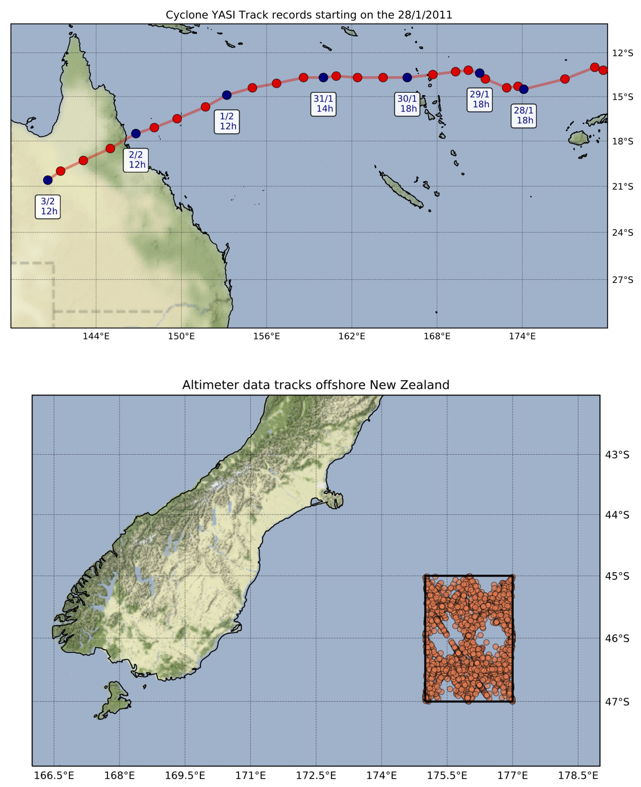
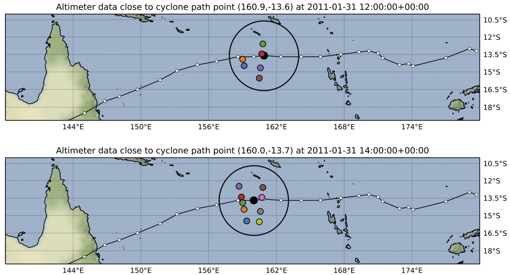

Quick start guide
=================

I/O Options
-----------

The most simple code lines to use **RADWave** functions is summarised below

.. code-block:: python
  :emphasize-lines: 3,4,5,9,11

  import RADWave as rwave

  wa = rwave.waveAnalysis(altimeterURL='../dataset/IMOSURLs.txt', bbox=[152.0,155.0,-36.0,-34.0],
                  stime=[1985,1,1], etime=[2018,12,31])
  wa.processingAltimeterData(altimeter_pick='all', saveCSV = 'altimeterData.csv')
  wa.visualiseData(title="Altimeter data tracks", extent=[149.,158.,-38.,-32.],
                 addcity=['Sydney', 151.2093, -33.8688], markersize=40, zoom=8,
                 fsize=(8, 7), fsave='altimeterdata')
  wa.timeSeries()
  wa.plotTimeSeries(time=[1995,2016], series='H', fsize=(12, 5), fsave='seriesH')
  wh_all = wa.seriesSeasonMonth(series='wh', time=[1998,2018], lonlat=None, fsave='whall', plot=True)

Getting altimeter values from data providers
*****

As previously mentioned, **RADWave** capabilities are illustrated using the Australian Ocean Data Network portal [`AODN <https://portal.aodn.org.au/>`_].
The altimeter dataset are available from the portal by searching for the following data collection:

* :code:`IMOS-SRS Surface Waves Sub-Facility - altimeter wave/wind data`

This global dataset has been compiled and extensively calibrated by [Ribal2019]_ and was regularly updated using altimeter data from 1985 to present. It can be downloaded in 1° x 1° URL files.

.. note::
  The video below illustrates how to select both a spatial bounding box and a temporal extent from the portal and how to export the file containing the :code:`List of URLs` used for wave analysis. This :code:`TXT` file contains a list of :code:`NETCDF` files for each available satellites.

.. raw:: html

    

    <iframe width="100%" height="550" src="https://www.youtube.com/embed/MpwkkWzqUHQ?rel=0" frameborder="0" allow="accelerometer; autoplay; encrypted-media; gyroscope; picture-in-picture" allowfullscreen></iframe>
    

.. important::
    **RADWave** uses the file containing the *list of URLs* to query via THREDDS the remote data. This operation can take several minutes and when looking at a large region it is recommended to divide the analyse in smaller regions and download a series of URLs text file instead of the entire domain directly.

A series of URLs text files is provided with the notebook `examples <https://github.com/pyReef-model/RADWave/tree/master/Notebooks/dataset>`_.

Loading altimeter parameters
*****

Once the list of :code:`NETCDF` data file has been saved on disk, you will be able to load it by initialising **RADWave** main Python class called :code:`waveAnalysis`.
For a detail overview of the options available in this class, the user is invited to look at the `waveAnalysis API`_.

.. code-block:: python

  import RADWave as rwave

  wa = rwave.waveAnalysis(altimeterURL='../dataset/IMOSURLs.txt', bbox=[152.0,155.0,-36.0,-34.0],
                          stime=[1985,1,1], etime=[2018,12,31])

.. note::
  In cases where one want to query altimeter data along a specific path such as a cyclone track, it will be necessary to provide a second file with the recorded track geographical coordinates and associated time. The file will be a :code:`CSV` file with in the header the following keyword names :code:`lon`, :code:`lat` & :code:`datetime`. An example of such a file is provided with the notebooks based on dataset exported from the Bureau of Meteorology (`BOM <http://www.bom.gov.au/cyclone/history/tracks/>`_). In such cases, the call to :code:`waveAnalysis` will take the form:

.. code-block:: python

  import RADWave as rwave

  wa = rwave.waveAnalysis(altimeterURL='../dataset/IMOS_YASI_east.txt', bbox=[170, 175, -17, -12],
                            stime=[2011,1,27], etime=[2011,2,4], cycloneCSV='../dataset/2010-YASI.csv')

After class initialisation querying the actual dataset is realised by calling the :code:`processingAltimeterData` function (option available in the `processingAltimeterData API`_)

.. code-block:: python

  wa.processingAltimeterData(altimeter_pick='all', saveCSV = 'altimeterData.csv')

The function can take some times to execute depending on the number of :code:`NETCDF` files to load and the size of the dataset to query.

.. note::
    This function relies mostly on Pandas (library) and writes the processed dataset to file that can be later used to access more efficiently altimeter information.

In case where the *processingAltimeterData* function has already been executed, one can load directly the processed data from the created CSV file in a more efficient way by running the :code:`readingAltimeterData` function as follow:

.. code-block:: python

  wa.readingAltimeterData(saveCSV = 'altimeterData.csv')

Computing wave regime
*****

To perform wave analysis and compute the wave parameters discussed in the `documentation <https://radwave.readthedocs.io/en/latest/method.html>`_, two additional functions are available:

* :code:`timeSeries` see the `timeSeries API`_ for the available options. This function computes time series of wave characteristics from significant wave height :math:`H_{s}` and wind speed :math:`U_{10}`. It computes the both **instantaneous** and **monthly** wave variables. The class :code:`waveAnalysis` stores a Pandas dataframe (called :code:`timeseries`) of computed wave parameters that can be subsequently used for further analysis.
* :code:`close2Track` see the `close2Track API`_ for the available options. This function can be used when analysing cyclone tracks and finds the closest processed altimeter geographical locations that have been   recorded in the database based on a KDTree search. As for the previous function, this one stores a Pandas dataframe (called :code:`cyclone_data`) of closest wave data that can be subsequently used for further analysis.

.. code-block:: python

  wa.timeSeries()
  wa.close2Track(radius=2.,dtmax=6.)

Outputs
*******

We provide several default plotting functionalities within **RADWave** package.

.. note::
  Plotting functions rely on `Cartopy <https://scitools.org.uk/cartopy/docs/latest/>`_, `Seaborn <https://seaborn.pydata.org>`_, `Pandas <https://pandas.pydata.org/>`_ and Matplotlib libraries.

In most of these functions it is possible to export the figures as :code:`PNG` files and for better rendering we recommend in Jupyter Notebooks to add the following matplotlib commands in your code cell:

.. code-block:: python

  %matplotlib inline
  %config InlineBackend.figure_format = 'svg'

These functions are quickly presented below:

* :code:`plotCycloneTracks` see the `plotCycloneTracks API`_ for the available options.
* :code:`visualiseData` see the `visualiseData API`_ for the available options.

.. code-block:: python

  wa.plotCycloneTracks(title="Cyclone YASI Track", markersize=100, zoom=4,
                     extent=[138, 180, -30, -10], fsize=(12, 10))

  wa.visualiseData(title="Altimeter data", extent=[138, 180, -30, -10.0],
                  markersize=35, zoom=4, fsize=(12, 10), fsave=None)

* :code:`plotTimeSeries` see the `plotTimeSeries API`_ for the available options.
* :code:`seriesSeasonMonth` see the `seriesSeasonMonth API`_ for the available options.

.. image:: ../RADWave/Notebooks/images/img6.jpg
   :scale: 16 %
   :alt: plotting functions 2
   :align: center

.. code-block:: python

  wa.plotTimeSeries(time=[1995,2016], series='H', fsize=(12, 5), fsave='seriesH')
  whdata = wa.seriesSeasonMonth(series='wh', time=[1998,2018], lonlat=None, fsave='whall', plot=True)

* :code:`cycloneAltiPoint` see the `cycloneAltiPoint API`_ for the available options.

.. code-block:: python

  wa.cycloneAltiPoint(showinfo=True, extent=[138, 180, -18, -10],
                  markersize=35, zoom=4, fsize=(12, 5))

Running examples
----------------

There are different ways of using the **RADWave** package. If you used a local install with :code:`pip`, you can download the *Jupyter Notebooks* provided in the Github repository...

.. code-block:: bash

  $ git clone https://github.com/pyReef-model/RADWave.git

Binder
***************

The series of *Jupyter Notebooks* can also be ran with **Binder** that opens those notebooks in an executable environment, making the package immediately reproducible without having to perform any installation.

.. image:: https://mybinder.org/badge_logo.svg
  :target: https://mybinder.org/v2/gh/pyReef-model/RADWave/binder?filepath=Notebooks%2F0-StartHere.ipynb

This is by far the most simple method to test and try this package, just
launch the demonstration at `RADWave-live (mybinder.org) <https://mybinder.org/v2/gh/pyReef-model/RADWave/binder?filepath=Notebooks%2F0-StartHere.ipynb>`_!

.. image:: ../RADWave/Notebooks/images/binder.jpg
   :scale: 30 %
   :alt: binder
   :align: center

Docker
***************

Another straightforward installation that again does not depend on specific compilers relies on the **docker virtualisation system**. Simply look for the following Docker container **pyreefmodel/radwave**.

.. note::
  For non-Linux platforms, the use of `Docker Desktop for Mac`_ or `Docker Desktop for Windows`_ is recommended.

.. _`Docker Desktop for Mac`: https://docs.docker.com/docker-for-mac/
.. _`Docker Desktop for Windows`: https://docs.docker.com/docker-for-windows/

.. _`waveAnalysis API`: https://radwave.readthedocs.io/en/latest/RADWave.html#RADWave.altiwave.waveAnalysis
.. _`processingAltimeterData API`: https://radwave.readthedocs.io/en/latest/RADWave.html#RADWave.altiwave.waveAnalysis.processingAltimeterData
.. _`timeSeries API`: https://radwave.readthedocs.io/en/latest/RADWave.html#RADWave.altiwave.waveAnalysis.timeSeries
.. _`seriesSeasonMonth API`: https://radwave.readthedocs.io/en/latest/RADWave.html#RADWave.altiwave.waveAnalysis.seriesSeasonMonth
.. _`close2Track API`: https://radwave.readthedocs.io/en/latest/RADWave.html#RADWave.altiwave.waveAnalysis.close2Track
.. _`visualiseData API`: https://radwave.readthedocs.io/en/latest/RADWave.html#RADWave.altiwave.waveAnalysis.visualiseData
.. _`plotTimeSeries API`: plotTimeSeries https://radwave.readthedocs.io/en/latest/RADWave.html#RADWave.altiwave.waveAnalysis.plotTimeSeries
.. _`plotCycloneTracks API`: https://radwave.readthedocs.io/en/latest/RADWave.html#RADWave.altiwave.waveAnalysis.plotCycloneTracks
.. _`cycloneAltiPoint API`: https://radwave.readthedocs.io/en/latest/RADWave.html#RADWave.altiwave.waveAnalysis.cycloneAltiPoint

.. [Ribal2019] Ribal, A. & Young, I. R. -
    33 years of globally calibrated wave height and wind speed data based on altimeter observations. **Scientific Data** 6(77), p.100, 2019.
